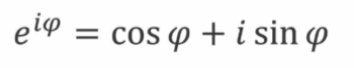
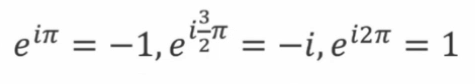
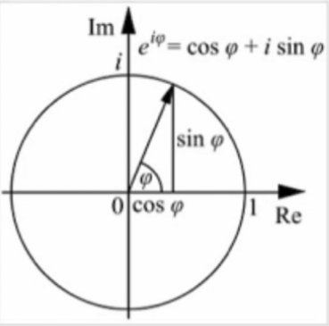

# Go language study
## Chapter One
#### Installation
##### 1. 下载
   * 官网：<https://www.golang.org>
   * GO语言中文网:<https://studygolang.com/dl>
   * 正常安装，暂时不考虑GO_PATH的作用。
##### 2. 开发环境
   * vi,emacs,idea,eclipse,vs,sublime…… + go插件
   * IDE：Goland, LiteIDE
## Chapter two
### 1.Go语言的基本语法
```
package main

import "fmt"

func main() {
    fmt.Println("Hello World")
}
```
#### 1.1 变量的定义
   * 用var关键字定义
   * 变量的类型写在变量名之后
   * 变量可以定义在函数内部，或者直接定义在包内(函数外部)，定义在函数内时，var可以省略，用`:=`代替
   * 定义在函数外部的变量的作用域为包范围而不是全局变量
   * var()集中定义变量
   * 变量可以同时定义多个，且不需要必有初始值
   * 变量定义之后必须被使用，否则报错
   * 变量类型可以省略，编译器根据赋值判断
   
   ```
   func variableValue() {
        var a,b int = 3, 4 //可同时声明多个
        var s string = "abc"
        var c = true //可省略变量类型
        d := 5 //可用 := 代替var
        fmt.Println(a, b, c, d, s)
   }
   ```
#### 1.2 内建变量类型
   * bool string
   * (u)int int8 int16 int32 int64 uintptr
      + 加u为无符号整数，不加则为有符号整数
      + 规定长度与不规定长度，不规定程度的整数根据操作系统来定义长度
      + uintptr 指针 长度根据操作系统
   * byte rune
      + rune GO语言的字符型，即char，长度为32位，byte 8位
   * float32 float64 complex64 complex128
      + complex 复数类型 1+i 
        - 复数分为实部和虚部 【泰勒级数展开】   
             
             
             
#### 1.3 强制类型转换
   * 类型的转换是强制的
#### 1.4 常量的定义
   * const数值不规定类型则可以作为各种类型使用
   * 普通枚举类型`enums`
   * 自增值枚举类型`iota`

> #### 变量定义的要点
> + 变量类型写在变量名之后
> + 编译器可以推测变量类型
> + 没有char，只有rune
> + 原生支持复数类型
### 2. 条件查询
#### 2.1 if
```
if contents, err != ioutil.ReadFile(filename);err == nil{
        fmt.Println(string(contents))
}else{
    fmt.Println("cannot print file contents:",err)
}
```
* if的条件里可以赋值
* if的条件里赋值的变量作用域就在这个if的语句里
#### 2.2 switch
* switch会自动break，除非使用fallthrough
* switch后可以没有表达式
### 3. 循环
* for的条件不需要括号
* for的条件可以省略初始条件，结束条件，递增表达式
* 省略初始条件相当于while
* 全省略是死循环

>* for if 后面的条件没有括号
>* if条件里也可以定义变量
>* 没有while
>* switch不需要break，也可以直接switch多个条件
### 4. 函数
* func eval(a,b int, op string) int
* 函数可返回多个值
* 返回的多个值可以起名字
* 仅用于非常简单的函数
* 对于调用者而言没有区别
* 返回值类型写在最后面
* 函数可以作为参数
* 没有默认参数，可选参数
### 5.指针
* 指针不能运算
* Go语言只有值传递一种方式
## chapter three
### 1. 数组，切片和容器
#### 1.1 数组
*  `arr [len]int`/`arr:=[len]int{}`/`arr:=[...]int{}`
* 数组的遍历--range关键字:
  ```
  sum:=0
  for _,v := range numbers{
  }
  ```
    + 可通过`_`省略变量
    + 不仅range，任何地方都可以用`_`省略变量
    + 如果只要i,可以写成`for i:=range numbers`
   >为什么要用range
   >    - 意义明确，美观
   >    - c++: 没有类似能力
   >    - java/python: 只能foreach value,不能同时获取i，v

* 数组是值类型
   + `[10]int`和`[20]int`是不同类型
   + 调用`func f(arr [10]int)`会拷贝数组
   + 在go语言中一般不直接使用数组
#### 1.2 切片slice
```
arr:=[...]int{0,1,2,3,4,5,6,7}
s:=arr[2:6]
s[0]=10
```
* s的值为`[2 3 4 5]`
* slice 本事没有数据，是对底层array的一个view
* arr的值变为`[0 1 10 3 4 5 6 7]`
* slice的扩展
```
arr:=[...]int{0,1,2,3,4,5,6,7}
s1:=arr[2:6]
s2:=s1[3:5]
```
结果是`s1=[2,3,4,5]，s2=[5,6]`
* slice的实现
   + slice 的结构中含有 ptr，len，cap三个参数
   + slice可以向后扩展，不能向前扩展。
   + `s[i]`不可超越len(s)，向后扩展不可以超越底层数组cap(s)
* 向slice添加元素
   + 添加元素时如果超越cap,系统会重新分配更大的底层数组
   + 由于值传递的关系，必须接受append的返回值
   + s=append(s,val)
* 删，建
   + 直接用`[:]`截取
   + `make([]int,len,cap)`
#### 1.3 Map
```
m:= map[string]string{
    "name":"ccmouse",
    "course":"golang",
    "site":"imooc",
    "quality":"notbad",
}
```
* map定义:`map[K]V`,`map[K1]map[K2]V`
   + 创建：`make(map[string]int)`
   + 获取元素:`m[key]`
   + key不存在时，获得Value类型的初始值
   + 用 `value,ok:=m[key]`来判断是否存在key
   + delete删除一个key
* map的遍历
   + 使用range 遍历key 或者遍历key value对
   + 不保证遍历顺序，如需顺序，需要手动对key排序
   + 使用len获取元素 个数
* map的key
   + map使用哈希表，必须可以比较相等
   + 除了slice，map，function的内建类型都可以作为key
   + struct类型不包含上述字段，也可以做key
* 例：寻找最长不含有重复字符的子串
