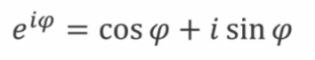
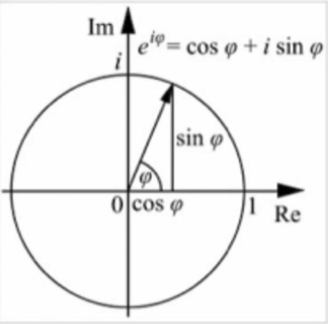

# Go language study
## Chapter two
### 1.Go语言的基本语法
```
package main

import "fmt"

func main() {
    fmt.Println("Hello World")
}
```
#### 1.1 变量的定义
   * 用var关键字定义
   * 变量的类型写在变量名之后
   * 变量可以定义在函数内部，或者直接定义在包内(函数外部)，定义在函数内时，var可以省略，用`:=`代替
   * 定义在函数外部的变量的作用域为包范围而不是全局变量
   * var()集中定义变量
   * 变量可以同时定义多个，且不需要必有初始值
   * 变量定义之后必须被使用，否则报错
   * 变量类型可以省略，编译器根据赋值判断
   
   ```
   func variableValue() {
        var a,b int = 3, 4 //可同时声明多个
        var s string = "abc"
        var c = true //可省略变量类型
        d := 5 //可用 := 代替var
        fmt.Println(a, b, c, d, s)
   }
   ```
#### 1.2 内建变量类型
   * bool string
   * (u)int int8 int16 int32 int64 uintptr
      + 加u为无符号整数，不加则为有符号整数
      + 规定长度与不规定长度，不规定程度的整数根据操作系统来定义长度
      + uintptr 指针 长度根据操作系统
   * byte rune
      + rune GO语言的字符型，即char，长度为32位，byte 8位
   * float32 float64 complex64 complex128
      + complex 复数类型 1+i 
        - 复数分为实部和虚部 【泰勒级数展开】   
             
             
             
#### 1.3 强制类型转换
   * 类型的转换是强制的
#### 1.4 常量的定义
   * const数值不规定类型则可以作为各种类型使用
   * 普通枚举类型`enums`
   * 自增值枚举类型`iota`

> #### 变量定义的要点
> + 变量类型写在变量名之后
> + 编译器可以推测变量类型
> + 没有char，只有rune
> + 原生支持复数类型
### 2. 条件查询
#### 2.1 if
```
if contents, err != ioutil.ReadFile(filename);err == nil{
        fmt.Println(string(contents))
}else{
    fmt.Println("cannot print file contents:",err)
}
```
* if的条件里可以赋值
* if的条件里赋值的变量作用域就在这个if的语句里
#### 2.2 switch
* switch会自动break，除非使用fallthrough
* switch后可以没有表达式
### 3. 循环
* for的条件不需要括号
* for的条件可以省略初始条件，结束条件，递增表达式
* 省略初始条件，递增条件相当于while
* 全省略是死循环

>* for if 后面的条件没有括号
>* if条件里也可以定义变量
>* 没有while
>* switch不需要break，也可以直接switch多个条件
### 4. 函数
* func eval(a,b int, op string) int
* 函数可返回多个值
* 返回的多个值可以起名字
* 仅用于非常简单的函数
* 对于调用者而言没有区别
* 返回值类型写在最后面
* 函数可以作为参数
* 没有默认参数，可选参数
### 5.指针
* 指针不能运算
* Go语言只有值传递一种方式
